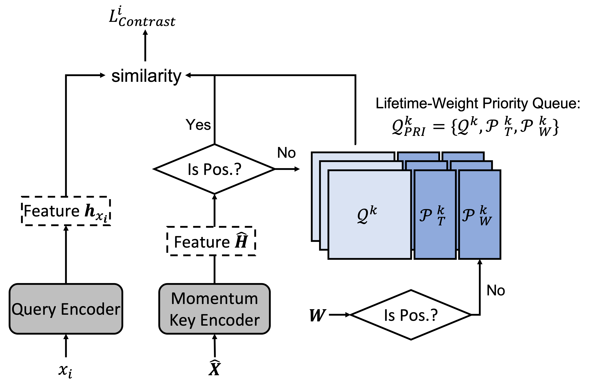

# Reducing and Exploiting Data Augmentation Noise through Meta Reweighting Contrastive Learning for Text Classification
## Model Structure: 

## Meta Reweight Module:

## Lifetime-Weight Aware Contrastive Learning


## Running Scripts. 
Assuming you have done the following preparation:
 - Downloaded, processed and saved your task data files: say it is in ``/Dataset`` and task name is ``mnli``
 - Having the devices (gpus) ready for experiment: say you have two gpus and you can allocate 2 trails per gpu (for grid search)
 - Saved your hyper-parameter settings (including the grid search) in a yml file: say it is at ``/config/contrastive_roberta_mnli.yml``
 - Ready to name your next experiment: say ``my_exp``
 - Going to redirect your outputs to a file: say ``result.out``

Then you may run your experiment in the following way:<br>
```
CUDA_VISIBLE_DEVICES=0,1 nohup python3 -u parallel_main.py \
    --random_seed 123 \
    --model_config_path ./config/contrastive_roberta_mnli.yml \
    --special_tag my_exp \
    --gpus 2 \
    --gpus_per_trail 0.5 \
    --task_name mnli \
    > result.out &
```
Then you will be able to check the status prints in ``result.out`` and the logs in a newly created folder named under ``special_tag + task_name``<br>
Feel free to play with our script/code and enjoy your journey of research discovery! Yeah!

## Citing our work
If you are interested in this paper, please consider cite our work:
 - Reducing and Exploiting Data Augmentation Noise through Meta Reweighting Contrastive Learning for Text Classification
 - IEEE Big Data 2021
 - Guanyi Mou[^1], Yichuan Li[^1], Kyumin Lee

 [^1]: Equal contribution.
 
 ```
 @inproceedings{mou2021reducing,
  title={Reducing and Exploiting Data Augmentation Noise through Meta Reweighting Contrastive Learning for Text Classification},
  author={Mou, Guanyi and Li, Yichuan and Lee, Kyumin},
  booktitle={2021 IEEE International Conference on Big Data (Big Data)},
  pages={876--887},
  year={2021},
  organization={IEEE}
}
```


    
